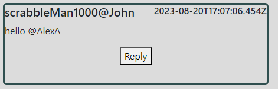
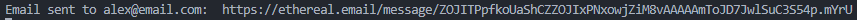
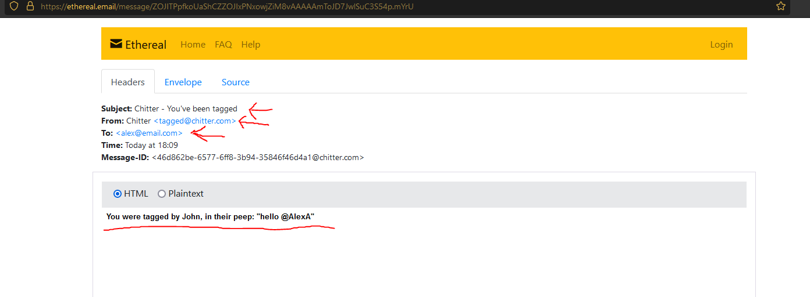
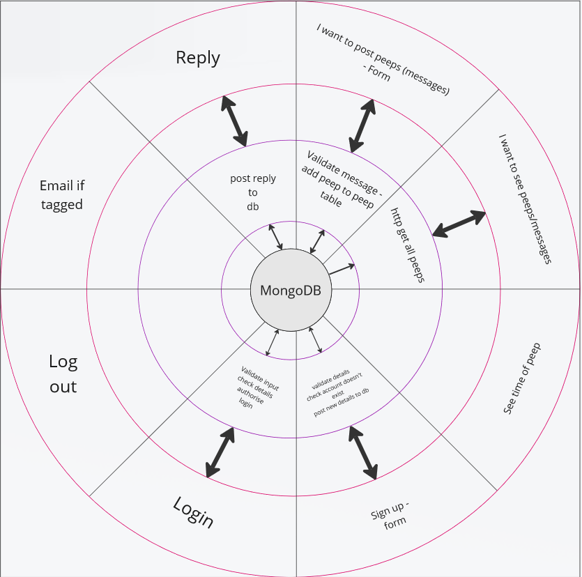
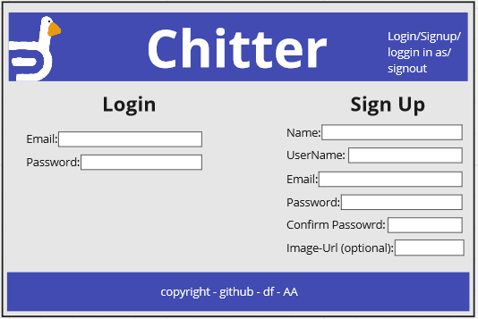
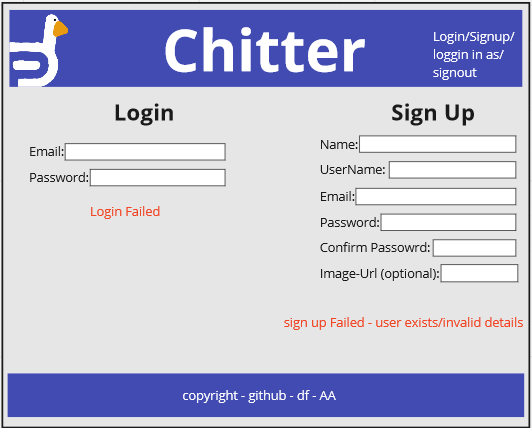
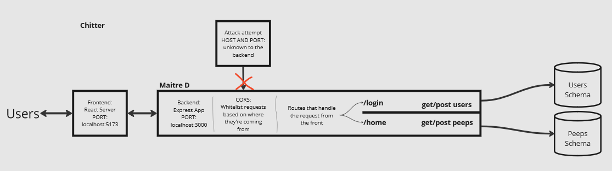

Chitter Challenge
=================


Submission Notes
-----------------
**Installation and running:**
- Backend
    - cd .\chitterBackend\

    - run npm i 

    - Before running the server, you can run 'npm run populate' - this will populate the database with some example users and peeps

    - for running the server:
        - npm run dev

    - for running the tests (make sure you have stopped the dev server first)
        - npm run test (this is without coverage)
        - npm run coverage (recommended - provides code coverage)

    - Note: I didn't have time to set up envs - please check inside the app.js that your local mongo server is running on the same address as line 18;

    - Note: The testing requires the database to be in a known state and will delete the contents of both database's - whilst testing I had two collections but for just having a look, the contents changing should be fine - you can always run 'npm run populate' to get those example peeps back

- Frontend
    - cd .\chitterFrontend\

    - run npm i

    - for running the frontend:
        - npm run dev
    
    -*IMPORTANT* PLEASE NAVIGATE TO 'http://127.0.0.1:5173/home' AS THAT'S THE ROUTE FOR THE MAIN ALL PEEPS PAGE - IF YOU ARE SEEING JUST A WHITE SCREEN | MAKE SURE YOU ARE ON THE '/home' ROUTE.
    
    - for running the tests 
        - npm run test (this is without coverage)
        - npm run coverage (recommended - provides code coverage)
        - NOTE: There is either on a few or no tests for the frontend - explained further down
    - *IMPORTANT*: THERE IS A KIND OF MAJOR BUG WITH THE LOGIN FUNCTIONALITY. 
        - When you got to login - if you input wrong information and refresh the page, it will log in you in as no one which will cause problems - I know why the issue is occurring but I have ran out of time to figure out a solution. 
        - If you are on the main page and it says logged in as then a blank space, please press logout and sign in with a valid account.

- If you ran the populate command in the backend, then there are a few account you can sign us, here are a few of them:
    - 'ScrabbleMan1000'
        - scrabb1000@email.com
        - password1
    
    - 'scrabbleMan1001'
        - scrabb1001@email.com
        - password2
    
    - 'DFAirlines'
        - dfair@email.com
        - password3

    - 'DFBank'
        - dfbank@email.com
        - password4
    

**This submission implements both the standard and extended criteria:**
- you can view all peeps on /home
 
- you can login/sign up by pressing the login | sign up button on the top right

- you can login or sign up
    - logins are persistent, if the page is refreshed
    - you can only sign up if your username and email are unique
    - I ran out of time to add the pop-ups for failed login/sign up

- You can logout by pressing the logout button on the top right

- You can return to the home/all peeps page by clicking the logo or Chitter header

- If you are logged in you can write a peep and post it to the all peeps wall
    - this will re-render the page automatically

- Each Peep has the 'name@username', the date (ISO 8601 format), and are displayed in reverse chronological order

- If you are logged in, you can see a reply button, this will post a new reply underneath the relevant Peep
    - the replies are in chronological order (so you can follow a thread)
    - Replies also re-render the page
    - once a reply has been sent and is successful, a button will become visible allowing you to see all the replies
    - the button is only visible on Peeps with replies
    - you do not have to be logged in to view the replies

- If you write a Peep and @ a user by their username, this is considered tagging
    - emails will be sent to all tagged uses in peeps as well as replies
    - you can tag multiple users at once and they will all receive an email
    - it works by searching for words with an @ prefix and using that to find the emails of those users, thus it will only send emails to users who exist
    - *IMPORTANT*: I used an npm package called 'nodemailer' and they require you create a mail transport, I didn't have the time to set up a gmail SMTP, so I used the built in test account. 
    - To view the email to a tagged user, if you post a peep, @ing a valid user, check the console of the express server for a link which will take you to a testing email site with the email that the user would receive if gmail was set up.
    - The populate script doesn't show the tagging functionality - you will have to start tagging valid users yourself to see it  
    - It will look like this:



    


**Despite having implemented all the criteria - I consider this to be a partial completion:**

- I didn't have time to implement Express Validation - Express Validator is installed and I set up the middleware functions for doing express validation but I didn't get any further than that

- The passwords of each user are store in plain text - a big no no - but I found it easier for development, if I could see all the information of each of my test users - given more time I would have used bcrypt to encrypt each users passwords

- I ran out of time to finish the prop type validation in react, though a lot of the react components have it. Again, given more time I would have gone through everything react component and implemented the PropType validation 

- Testing the front end is something that I find very confusing to implement as well as very time consuming, and I simply ran out of time to test it as much as I would like - this is something I will definitely get to grips with post academy

- The sign up and log in page don't display anything on success or failure of the respective actions

- The Peeps, as well as the login/sign up page have some styling issues, with the latter looking nothing like its wireframe, given more time these would have been improved, and they will be.

- NOTE TO SELF: You didn't consider case sensitivity for usernames or emails, could you have '@test' and '@Test' - test this later. However, technically if you try to sign up with two usernames of the same case it will not allow it. Technically this means that the usernames and emails are unique but go through an compare.
    - https://stackoverflow.com/questions/7101703/how-do-i-make-case-insensitive-queries-on-mongodb
    - https://stackoverflow.com/questions/71573222/how-to-make-mongoose-query-case-insensitive


Design Process/Dev Log 
-----------------------

Firstly, in each of the folders in this mono-repo, there is a references mark down file for both front and backend. This is to keep the relevant information in each folder, and to make it easier to see where the sources I found were used. The frontend references file is much bigger than the backend. 

There is also a lot of links within the code itself which I used a sources of information, they should be in the references but if not, they should be referred to in the code.

I started Off with a Miro board where I set up a Kanban board for my tasks as well as creating a layout diagram with each segment dedicated to one of user stories. This is pictured below:



My plan was to make two pages, one of viewing peeps and another for logging in a sign up, so I created some wireframes in Miro to refer to when creating my front end. Below you will find the wireframes for the all peeps page as well as the login/sign up page (one image is the normal and the other is when incorrect information was submitted): 






Alongside the front end, I also designed the backend, with its routes and services and create a quick mock up of how the system should look (after getting some guidance from Ed (you?)) Below is the design:



I also designed a flow chart for how I expected my sign up system to work, with validation.


From here on in, it was writing code, some tests, and using the Kanban board to check progress and break tasks down into smaller parts.

I did have the foresight to add an array to my Peeps schema at beginning of the project and it paid off by using push with mongoose. I also wanted to have optional profile pictures by using the html img attribute but never got round to it, my users schema reflects this early plan but having an optional field for profile picture URLS.

I also wanted to modals but there were scrapped due to time constraints.

Chitter Requirement Spec
------------------------
* Feel free to use Google, your notes, books, etc. but work on your own
* If you refer to the solution of another coach or trainee, please put a link to that in your README
* If you have a partial solution, **still check in a partial solution**
* You must submit your work by 9:30am Monday morning

Challenge:
-------

As usual please start by forking this repo.

We are going to write a small twitter clone that will allow users to post messages to a public wall.

Good luck and let the chitter begin!

Features:
-------

### Standard Acceptance Criteria
```
As a trainee software engineer
So that I can let people know what I am doing  
I want to post a message (peep) to chitter

As a trainee
So that I can see what others are saying  
I want to see all peeps in reverse chronological order

As a trainee
So that I can better appreciate the context of a peep
I want to see the time at which it was made

As a trainee
So that I can post messages on Chitter as me
I want to sign up for Chitter

As a trainee
So that only I can post messages on Chitter as me
I want to log in to Chitter

As a trainee
So that I can avoid others posting messages on Chitter as me
I want to log out of Chitter
```

Additional requirements:
------

* You don't have to be logged in to see the peeps.
* Trainee software engineers sign up to chitter with their email, password, name and a username (e.g. ewright@digitalfutures.com, password123, Ed Wright, edwright6975).
* The username and email are unique.
* Peeps (posts to chitter) have the name of the trainee and their user handle.
* Your README should indicate the technologies used, and give instructions on how to install and run the tests.

### Extended Acceptance Criteria

```
As a trainee
So that I can stay constantly tapped in to the shouty box of Chitter
I want to receive an email if I am tagged in a Peep

As a trainee
In order to start a conversation as a DFA trainee Software Engineer
I want to reply to a peep from another trainee.
```
